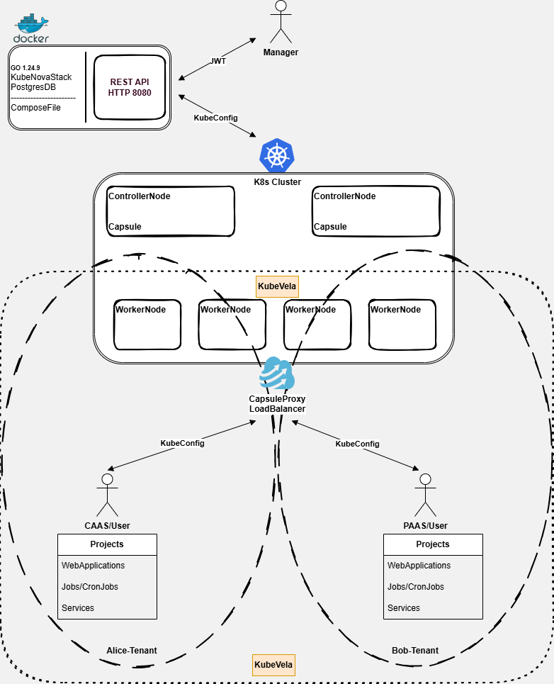

# KubeNova + Capsule + KubeVela
### Multi‑Tenant Control Plane & App Delivery

---

## Overview

KubeNova is a **central control plane** for multi‑tenant Kubernetes environments.
It integrates:

- **Capsule** for multi‑tenancy and tenant isolation.
- **capsule‑proxy (access proxy)** for tenant/project‑scoped `kubectl` access.
- **KubeVela** for application delivery on top of your clusters.

The KubeNova **Manager** exposes a single OpenAPI‑first REST surface at `/api/v1`.
It stores clusters, tenants, projects, apps, plans, and policysets in a backing store
(Postgres or in‑memory), and installs/coordinates in‑cluster **Agents** that
talk to Capsule, capsule‑proxy, and KubeVela.

Current release: **0.9.5**

---

## Architecture (High‑Level)

- **Manager (control plane)**
  - HTTP API at `/api/v1` (see `docs/openapi/openapi.yaml`).
  - Persists clusters, tenants, projects, apps, policysets (`internal/store`).
  - Installs and monitors Agents into registered clusters.
  - Issues tenant/project‑scoped kubeconfigs that always target the access proxy.

- **Agent (per cluster)**
  - Runs controllers using `controller-runtime` (`internal/reconcile`):
    - `ProjectReconciler`: keeps Namespaces and Capsule Tenants in sync.
    - `AppReconciler`: projects ConfigMaps into KubeVela `Application` resources.
  - Publishes telemetry (events/metrics/logs) back to the Manager.

- **Adapters & Backends**
  - Capsule adapter: manages Capsule Tenant CRDs and multi‑tenant namespaces.
  - Vela backend: manages KubeVela `Application`, revisions, traits, policies.
  - Proxy backend: issues JWT‑backed kubeconfigs for capsule‑proxy (used by Manager).

Users interact with KubeNova via the Manager API (curl/HTTP) and then use the
issued kubeconfigs with `kubectl` against capsule‑proxy for day‑to‑day work.

---

### Managed cluster topology

For each registered cluster, KubeNova coordinates the following logical nodes inside the managed cluster:

- **Kubernetes control plane** – the cluster's own API server and etcd.
- **Tenancy stack (Capsule)** – controllers and CRDs that enforce tenant and namespace isolation.
- **Access proxy (capsule-proxy)** – HTTP proxy that terminates kubeconfigs issued by KubeNova and enforces RBAC via Capsule groups.
- **App delivery core (KubeVela)** – controllers and CRDs that turn App specs into running workloads.
- **KubeNova Agent** – per-cluster controller that watches KubeNova state, reconciles Capsule tenants/projects, and projects Apps into KubeVela Applications.

End-to-end flow for a managed cluster:

1. The Manager registers the cluster and installs the Agent.
2. Users call the Manager API to define clusters, tenants, projects, and apps.
3. The Agent reconciles this intent into Capsule, capsule-proxy, and KubeVela resources in the managed cluster.
4. Users use the issued kubeconfigs to talk to capsule-proxy, which forwards requests to the cluster API server with the correct tenant/project scope.

The diagram below shows these nodes and control/data paths for all managed clusters:



## Installation

### Helm Repos

Manager and Agent are shipped as Helm charts.

```bash
helm repo add kubenova-dev https://vaheed.github.io/kubenova/charts/dev
helm repo add kubenova     https://vaheed.github.io/kubenova/charts/stable
helm repo update
```

### Manager Chart (cluster‑external control plane)

```bash
helm upgrade --install manager kubenova/manager \
  -n kubenova-system --create-namespace \
  --set image.tag=0.9.5 \
  --set env.KUBENOVA_REQUIRE_AUTH=true \
  --set env.MANAGER_URL_PUBLIC=http://kubenova-manager.kubenova-system.svc.cluster.local:8080 \
  --set env.CAPSULE_PROXY_URL=http://capsule-proxy.capsule-system.svc.cluster.local:9001 \
  --set env.AGENT_IMAGE=ghcr.io/vaheed/kubenova/agent:0.9.5
```

### Agent Chart (installed into target clusters)

```bash
helm upgrade --install agent kubenova/agent \
  -n kubenova-system \
  --set image.tag=0.9.5 \
  --set manager.url=http://kubenova-manager.kubenova-system.svc.cluster.local:8080 \
  --set redis.enabled=true \
  --set bootstrap.capsuleVersion=0.10.6 \
  --set bootstrap.capsuleProxyVersion=0.9.13
```

> See `env.example` for all supported environment variables and their meanings.

---

## Images & Versions

Charts are also published as OCI artifacts in GHCR:

```bash
helm registry login ghcr.io -u <user> -p <token>

# Pull latest main (alias)
helm pull oci://ghcr.io/vaheed/kubenova-charts/manager --version latest

# Pull a specific version
helm pull oci://ghcr.io/vaheed/kubenova-charts/manager --version 0.9.5

# Pull develop stream
helm pull oci://ghcr.io/vaheed/kubenova-charts/manager --version dev
helm pull oci://ghcr.io/vaheed/kubenova-charts/manager --version 0.9.5-dev

# Pull a release tag alias
helm pull oci://ghcr.io/vaheed/kubenova-charts/manager --version v0.9.5
```

Branch/tag mapping:

- `develop`: chart version is suffixed with `-dev` (for example, `0.9.5-dev`). A lightweight OCI tag alias `dev` also points to the same artifact.
- `main`: chart version is the normal semver (`0.9.5`). A lightweight OCI tag alias `latest` also points to the same artifact.
- Release tags (`vX.Y.Z`): an additional OCI tag alias `vX.Y.Z` is applied to the same artifact.

---

## Configuration

KubeNova reads configuration from environment variables and chart values. Key settings:

- **Database**
  - `DATABASE_URL` – Postgres connection string (required for production).
- **Auth & tokens**
  - `KUBENOVA_REQUIRE_AUTH` – when `true`, most endpoints require a Bearer JWT.
  - `JWT_SIGNING_KEY` – HS256 signing key used by the Manager for tokens and kubeconfigs.
- **Proxy & URLs**
  - `MANAGER_URL_PUBLIC` – URL used by Agents to reach the Manager.
  - `CAPSULE_PROXY_URL` – access proxy URL used in issued kubeconfigs (capsule‑proxy or equivalent).
- **Agent image & bootstrap**
  - `AGENT_IMAGE` – container image used when the Manager auto‑installs the Agent into target clusters.
  - `CAPSULE_VERSION`, `CAPSULE_PROXY_VERSION`, `VELA_CORE_VERSION` – optional version pins for bootstrap.

See `env.example` for full details and recommended values.

---

## Quickstart (API + kubectl)

For a complete curl walkthrough, see `docs/index.md`. At a high level:

1. **Get a token**
   - `POST /api/v1/tokens` to obtain a JWT for API calls.
2. **Register a cluster**
   - `POST /api/v1/clusters` with a base64‑encoded kubeconfig.
   - Manager stores the cluster and installs the Agent.
3. **Create tenant & project**
   - `POST /api/v1/clusters/{c}/tenants` to create a tenant.
   - `POST /api/v1/clusters/{c}/tenants/{t}/projects` to create a project (mapped to a Namespace).
4. **Grant project access**
   - `PUT /api/v1/clusters/{c}/tenants/{t}/projects/{p}/access` with members + roles (tenantOwner/projectDev/readOnly).
5. **Issue kubeconfigs**
   - Tenant‑scoped:
     - `POST /api/v1/tenants/{t}/kubeconfig`
   - Project‑scoped:
     - `GET /api/v1/clusters/{c}/tenants/{t}/projects/{p}/kubeconfig`
6. **Use kubeconfigs with kubectl**
   - Save the returned kubeconfig (`.kubeconfig` field) to a file and run:
     - `KUBECONFIG=<file> kubectl get ns`
     - `KUBECONFIG=<file> kubectl get pods -n <project-namespace>`

Users now manage workloads directly with `kubectl` via capsule‑proxy, while KubeNova remains the source of truth for tenants, projects, and apps.

---

## Apps & Delivery (Capsule + Vela)

KubeNova’s Apps API lets you describe workloads that will be delivered by KubeVela in the project namespace.

- **App API**
  - `GET /api/v1/clusters/{c}/tenants/{t}/projects/{p}/apps`
  - `POST /api/v1/clusters/{c}/tenants/{t}/projects/{p}/apps`
  - `GET /api/v1/clusters/{c}/tenants/{t}/projects/{p}/apps/{a}`
  - `PUT /api/v1/clusters/{c}/tenants/{t}/projects/{p}/apps/{a}`
  - Operations: `:deploy`, `:suspend`, `:resume`, `:rollback`, `:delete`, `status`, `revisions`, `diff`, `logs`, `traits`, `policies`, `image-update`, `workflow/run`.

- **Spec model**
  - See `App` in `docs/openapi/openapi.yaml`:
    - `name`, `description`
    - `components`: array of component objects (for example, web services, Helm‑based components, etc.).
    - `traits`: array of trait objects (scaling, ingress, etc.).
    - `policies`: array of policy objects (rollout strategies, security policies, etc.).

- **Projection to KubeVela**
  - The Manager materializes App specs into ConfigMaps in the project Namespace.
  - The Agent’s `AppReconciler` (`internal/reconcile/app.go`) reads these ConfigMaps and uses the Vela backend (`internal/backends/vela`) to create/update KubeVela `Application` resources.

The current implementation is intentionally generic; you can model WordPress, Grafana, or any other app by shaping the `components` and `traits` according to your KubeVela conventions.

---

## Security & Roles

- **Roles**
  - `admin`, `ops`, `tenantOwner`, `projectDev`, `readOnly`.
  - Used for API authorization and encoded in JWTs and kubeconfigs.

- **Groups**
  - KubeNova maps roles to Kubernetes groups so capsule‑proxy and RBAC can enforce access:
    - `tenantOwner` (and `admin`/`ops` where applicable) → `tenant-admins`
    - `projectDev` → `tenant-maintainers`
    - `readOnly` → `tenant-viewers`

- **Kubeconfigs**
  - All kubeconfigs issued by KubeNova target the access proxy (`CAPSULE_PROXY_URL`), not the raw kube‑apiserver.
  - JWTs embedded in kubeconfigs include `tenant`, optional `project`, `roles`, and `groups` claims.

See `docs/index.md` and `docs/openapi/openapi.yaml` for the precise behavior of `/tokens`, `/me`, and kubeconfig endpoints.

---

## Development & Testing

- **Run tests**
  - `make test-unit` – unit tests and integration stubs.
  - `go test ./... -count=1` – full Go test suite.

- **Format & vet (recommended)**
  - `go fmt ./...`
  - `go vet ./...`

- **Static analysis (optional)**
  - `staticcheck ./...`
  - `gosec ./...` – must have no HIGH findings before release.

---

## Docs & Roadmap

- API contract: `docs/openapi/openapi.yaml`.
- cURL + `kubectl` quickstart: `docs/index.md`.
- Design/overview and mapping references: this `README.md` and other files under `docs/`.
- Future work and platform‑level goals: `docs/roadmap.md`.

KubeNova adheres to semantic versioning; see `CHANGELOG.md` for a detailed list of changes between versions.
