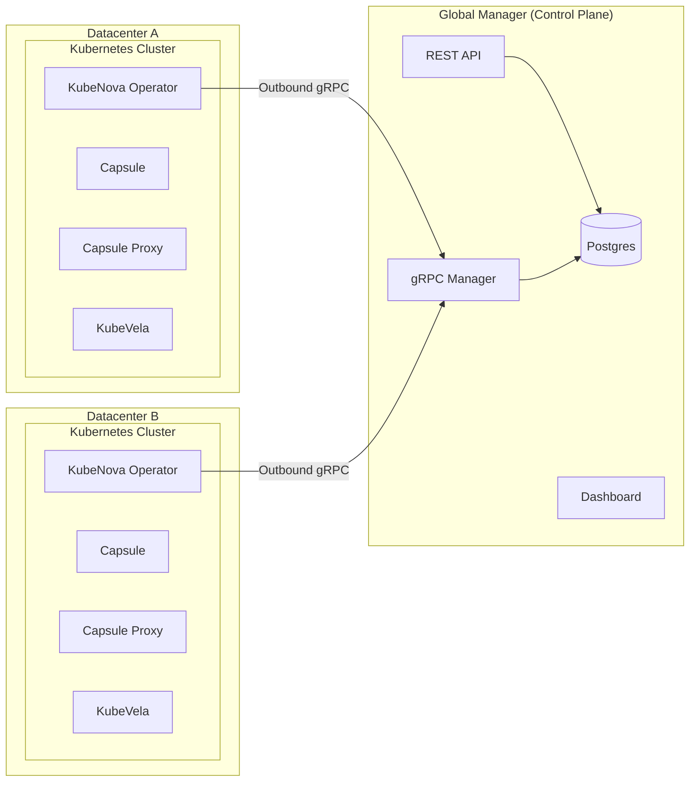
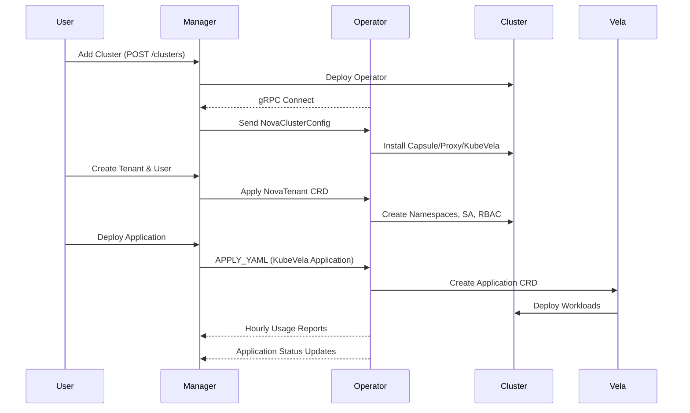
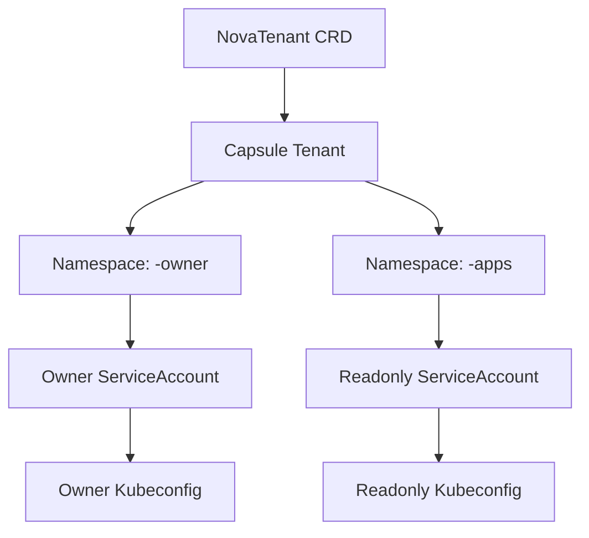
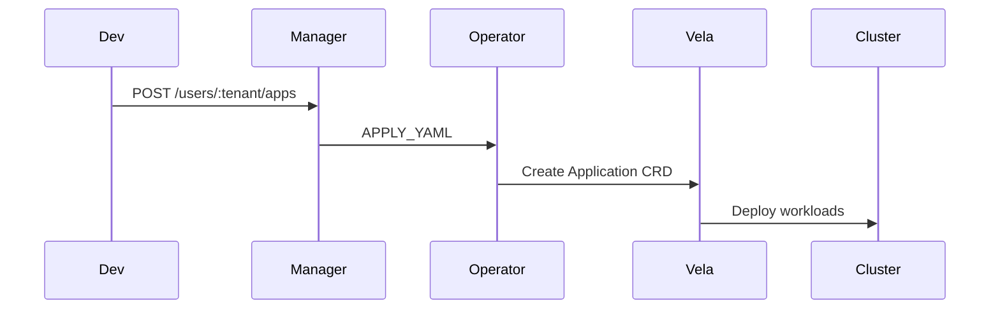

# KubeNova  
### Unified Multi-Datacenter CaaS/PaaS Platform  
### Manager Global — Clusters Sovereign — Tenants Isolated

---

## 🚀 Overview

KubeNova is a federated multi-datacenter platform providing secure CaaS/PaaS capabilities on top of Kubernetes.  
Each datacenter runs a **completely isolated Kubernetes cluster**, while a **single global Manager** coordinates metadata, tenant lifecycle, billing, and application orchestration — without ever directly accessing the clusters.

All cluster operations are handled by the **KubeNova Operator**, which runs inside each cluster and communicates outbound-only with the Manager via gRPC.

KubeNova integrates the following:

- **KubeNova Operator** — cluster bootstrap, tenant management, Vela integration  
- **Capsule** — multi-tenancy and namespace isolation  
- **Capsule Proxy** — per-tenant LoadBalancer isolation  
- **KubeVela** — application orchestration for users  

---

## ⚖️ Core Principles

- **Clusters are sovereign** — no cross-datacenter sharing.  
- **Zero inbound connectivity** — Operators initiate outbound gRPC to Manager.  
- **Manager never talks to Kubernetes APIs directly.**  
- **Tenants are strictly isolated** using Capsule and namespace scoping.  
- **KubeVela Applications are the only workload entrypoint.**  

---

## 🏛️ System Architecture

### Global System Diagram



---

## 🔄 Full Lifecycle Architecture

### End-to-End Workflow



---

## 🧱 Multi-Tenancy Model

KubeNova uses **Capsule** for multi-tenancy and **Capsule Proxy** for LoadBalancer isolation.

Each tenant receives:

- A Capsule Tenant  
- Two namespaces:  
  - `<tenant>-owner`  
  - `<tenant>-apps`  
- Two ServiceAccounts: owner + readonly  
- Two automatically generated kubeconfigs  
- One KubeVela Project  
- Unlimited KubeVela Applications  

### Tenant Bootstrap Diagram



---

## 🚀 Application Deployment (via KubeVela)

All user applications are defined as **KubeVela Application CRDs**.

### Deployment Flow



---

## 📊 Usage Reporting

Every hour the Operator aggregates per-tenant metrics:

- CPU & Memory Requests  
- PVC Storage Usage  
- LoadBalancer Count  
- Pod Count  
- Namespace Count  
- KubeVela Application Count  
- Quota Violations  

Usage is streamed to the Manager via gRPC.

---

## 🔐 Security Model

- **No inbound ports exposed**  
- **Outbound mTLS gRPC only**  
- **Encrypted kubeconfigs stored only for bootstrap**  
- **Capsule enforces strict boundaries**  
- **Capsule Proxy provides tenant LB isolation**  
- **Manager has no kubeadmin rights**  

---

## 🗂 Suggested Repository Layout

```
kubenova/
├── cmd/
│   ├── manager/
│   └── operator/
├── pkg/
│   ├── api/
│   ├── controllers/
│   ├── grpc/
│   ├── tenants/
│   └── kube/
├── config/
│   └── crd/
├── docs/
│   ├── rfc/
│   ├── adr/
│   ├── diagrams/
│   └── examples/
└── README.md
```

---

## 📚 Included Documentation

This repository includes:

- **Architecture RFC**  
- **ADR Set**  
- **Operator Controller Design**  
- **Manager API & Workflow**  
- **Multi-Tenant Policy & Structure**  
- **Diagrams in Mermaid format**  

---

## 🧩 Next Steps (Optional)

I can generate:

- `/docs/` folder with RFC, ADR, diagrams  
- GitHub Pages site  
- VitePress documentation  
- CRD YAML files  
- gRPC protobuf definitions  
- OpenAPI spec for Manager REST APIs  

Just let me know.

