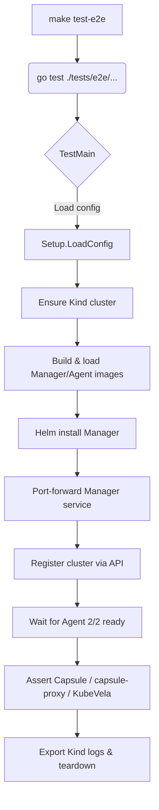

# Test Suite Overview

KubeNova uses layered testing to keep the control plane healthy. This document summarises the new end-to-end suite and how it plugs into CI.

## Directory layout

```
tests/
└── e2e/
    ├── setup/        # Kind, Helm, image build, port-forward helpers
    ├── scenarios/    # Parallel Go tests that orchestrate flows
    └── assertions/   # Reusable readiness checks and pollers
```

Each file shares the `package e2e` namespace so helpers and tests compose without additional imports.

## Execution flow



The flow is idempotent: rerunning the suite reuses the Kind cluster when `E2E_USE_EXISTING_CLUSTER=true`, skips Helm uninstall when `E2E_SKIP_CLEANUP=true`, and always emits `slog` statements for each step.

## CI integration

- `make test-e2e` is wired into `.github/workflows/ci.yml` as the `e2e_suite` job.
- The job installs Kind/kubectl/Helm, sets `E2E_BUILD_IMAGES=true`, and uploads the Go test log plus `kind export logs` artifacts.
- `charts_publish` and `charts_push_oci` depend on `e2e_suite`, so failing infrastructure tests block chart publication.

## Local tips

- Set `E2E_BUILD_IMAGES=false` to use the published `ghcr.io/vaheed/kubenova/*:dev` images when you only need API regression coverage.
- Increase `E2E_WAIT_TIMEOUT` (default `20m`) if running on slow machines or when debugging add-on installs.
- Use `E2E_MANAGER_PORT` to avoid clashes when multiple suites run side-by-side (for example in development containers).
- Override `E2E_REPO_ROOT` when invoking `go test` from outside the repository root (the suite defaults to auto-detecting the monorepo path using the helper package location).
